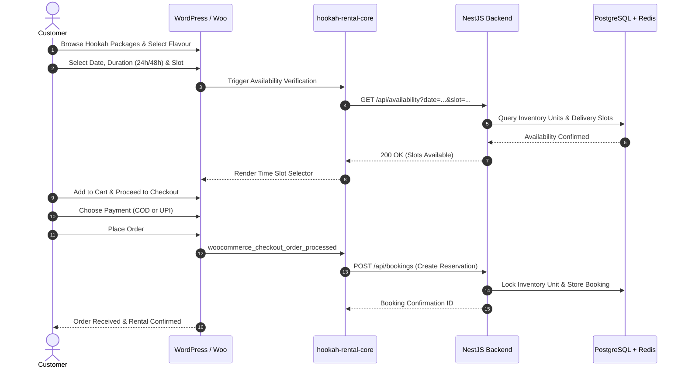

# BookNowShisha - System Architecture

## 1. Architectural Overview

BookNowShisha employs a hybrid headless architecture combining the CMS, SEO, and visual catalog capabilities of WordPress/WooCommerce with a robust, strictly-typed NestJS microservice backend, PostgreSQL relational database, and Redis cache/lock layer.

```
+-------------------------------------------------------------------+
|                        CUSTOMER BROWSER / UI                      |
| (Mobile-First Luxury Experience, Booking Widget, Cart & Checkout) |
+-------------------------------------------------------------------+
                                  │
                                  ▼
+-------------------------------------------------------------------+
|                     WORDPRESS + WOOCOMMERCE                       |
|   • Luxury Dark Custom Theme (booknowshisha-theme)                |
|   • Product Catalog, SEO & Editorial Content                      |
|   • Cart & Checkout Workflows                                     |
+-------------------------------------------------------------------+
                                  │
                                  ▼
+-------------------------------------------------------------------+
|              CUSTOM PLUGIN (hookah-rental-core)                   |
|   • Dynamic Availability & Slot Verification                      |
|   • Rental Meta & Product Synchronization                         |
|   • Secure API Bridge via Internal Secret                         |
+-------------------------------------------------------------------+
                                  │
                          REST / JSON (X-Core-Secret)
                                  │
                                  ▼
+-------------------------------------------------------------------+
|                        NESTJS CORE API                            |
|   • Identity, Auth & Role-Based Access Control (RBAC)             |
|   • Rental & Booking Lifecycle Engine                             |
|   • Real-Time Inventory (Serialised Units)                        |
|   • Delivery Slot Scheduling & Zone Allocation                    |
|   • UPI Payment Reconciliation & COD Collection                   |
|   • Returns Intake, Inspection & Security Deposits                |
|   • Comprehensive Audit Logging                                   |
+-------------------------------------------------------------------+
                │                                   │
                ▼                                   ▼
+-------------------------------+   +-------------------------------+
|     POSTGRESQL + PRISMA       |   |             REDIS             |
|  • Relational Data Store      |   |  • Availability Caching       |
|  • Schema Migrations & Enums  |   |  • Booking Locking            |
|  • Strict Foreign Constraints |   |  • Rate Limiting & Fast State |
+-------------------------------+   +-------------------------------+
```

---

## 2. Component Responsibilities

### 2.1 WordPress + WooCommerce (Storefront & CMS)
- **Customer Facing Experience**: Renders high-end dark luxury UI with smooth transitions and responsive layouts.
- **Product Catalog**: Digital store items, standard accessories, consumable flavour listings.
- **Cart & Standard Commerce**: Handles cart state, customer checkout form, and address collection.
- **SEO & Marketing**: Rich schema metadata, blogs, guides, and customer support pages.

### 2.2 Custom WordPress Plugin (`hookah-rental-core`)
- **Bridge Layer**: Safely communicates between WooCommerce events and the NestJS backend.
- **Rental Options & Widgets**: Custom date pickers, delivery time slot selectors, and 21+ legal age verification gates.
- **AJAX Availability Verification**: Queries NestJS before adding bookings to cart.

### 2.3 NestJS Backend (Business Logic Engine)
- **Central Authority**: Single source of truth for business rules, prices, active bookings, and payments.
- **Security & RBAC**: JWT access/refresh tokens, role guards (Customer, Staff, Admin, Super Admin), rate limiters, and audit logging.
- **Inventory Engine**: Tracks individual hookah items by unique serial numbers, barcodes, condition metrics, and lifecycle states (Available, Reserved, Rented, Maintenance).
- **Payment & Financial Tracking**: UPI payment intent generation, webhook verification, Cash on Delivery (COD) collection audit trails, and security deposit reconciliation.
- **Returns & Inspection**: Digital check-in checklists, damage logging with photographic evidence, and deposit deduction computation.

### 2.4 PostgreSQL & Prisma ORM
- Main relational database holding users, customers, staff, hookahs, flavours, packages, bookings, rentals, deliveries, payments, inspections, coupons, and audit logs.

### 2.5 Redis
- Distributed locking for concurrency-safe booking reservations.
- Cache layer for fast availability checks and delivery zone lookups.

---

## 3. End-to-End Customer Rental Flow



---

## 4. Security & Compliance Architecture
1. **Age Verification**: Mandatory legal affirmation at checkout (21+) with physical ID verification upon delivery.
2. **API Secret Isolation**: WooCommerce credentials and payment secrets are stored solely within the NestJS backend and never exposed to the frontend browser.
3. **Database Security**: Enforced parameterized queries via Prisma ORM preventing SQL injection.
4. **Transport Security**: HTTPS everywhere, Helmet HTTP security headers, CORS origin whitelisting.
5. **Auditing**: Every critical administrative action (status transition, payment mark, cash collection, damage report) generates an immutable `AuditLog` entry.
