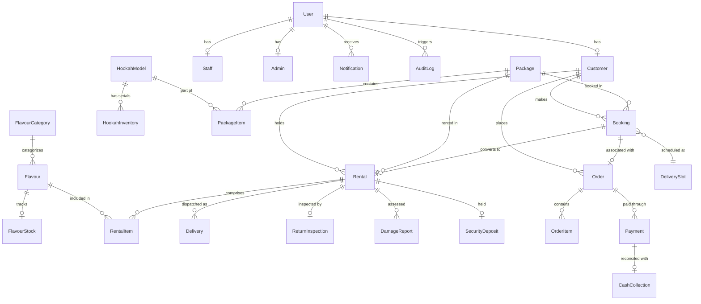

# BookNowShisha - Database Schema & Data Modeling

## 1. Overview
The database layer is built on **PostgreSQL 16** and managed using **Prisma ORM**.

The data model is partitioned into logical domains:
1. **Identity & Access Management** (`User`, `Customer`, `Staff`, `Admin`)
2. **Hookah Catalog & Physical Inventory** (`HookahModel`, `HookahInventory`)
3. **Flavours & Consumables** (`FlavourCategory`, `Flavour`, `FlavourStock`)
4. **Packages & Bundles** (`Package`, `PackageItem`)
5. **Reservations & Rentals** (`Booking`, `Rental`, `RentalItem`)
6. **E-Commerce & Orders** (`Order`, `OrderItem`)
7. **Logistics & Delivery** (`DeliveryZone`, `DeliverySlot`, `Delivery`)
8. **Financials & Payments** (`Payment`, `CashCollection`, `SecurityDeposit`)
9. **Returns & Quality Assurance** (`ReturnInspection`, `DamageReport`)
10. **Marketing, Notifications & Audits** (`Coupon`, `Notification`, `AuditLog`)

---

## 2. Core Entities & Relationships

---

## 3. Detailed Model Reference

### 3.1 Identity & Access
- **`User`**: Core authentication record holding email, password hash, role (`CUSTOMER`, `STAFF`, `ADMIN`, `SUPER_ADMIN`), 2FA secrets, and Google OAuth IDs.
- **`Customer`**: Customer address information, phone numbers, and optional `wpCustomerId` link.
- **`Staff`**: Delivery and field inspection personnel details.
- **`Admin`**: Administrative dashboard personnel.

### 3.2 Inventory & Hardware Tracking
- **`HookahModel`**: Catalog specification (name, height, material, base price, security deposit fee, WooCommerce product link).
- **`HookahInventory`**: Physical, individualized units holding unique serial numbers, barcodes, conditions (`EXCELLENT`, `GOOD`, `FAIR`, `MAINTENANCE`, `RETIRED`), and lifecycle statuses (`AVAILABLE`, `RESERVED`, `RENTED`, `IN_MAINTENANCE`, `DECOMMISSIONED`).

### 3.3 Flavours & Consumables
- **`FlavourCategory`**: Category groupings (e.g. Fruity, Mint, Exotic, Herbal).
- **`Flavour`**: Flavour brand, nicotine flag, and details.
- **`FlavourStock`**: Available units/heads with automated low-stock alert thresholds.

### 3.4 Packages & Rentals
- **`Package`**: Pre-configured rental bundles (e.g. Solo Standard 24h, Duo Weekend 48h, VIP 72h) including allowed flavours, coals, and mouthpieces.
- **`Booking`**: Customer reservation with duration, delivery slot, and address.
- **`Rental`**: Active lifecycle record (`RESERVED` -> `PREPARING` -> `OUT_FOR_DELIVERY` -> `DELIVERED` -> `ACTIVE` -> `RETURN_PENDING` -> `RETURNED` -> `INSPECTED` -> `COMPLETED`).
- **`RentalItem`**: Specific inventory unit and flavour assigned to a rental.

### 3.5 Delivery & Payments
- **`DeliveryZone`**: PIN code coverage zones and base delivery pricing.
- **`DeliverySlot`**: Time windows with maximum booking capacities.
- **`Delivery`**: Dispatch instance assigned to a staff courier.
- **`Payment`**: Method (`COD`, `UPI`), status (`PENDING`, `SUCCESS`, `REFUNDED`), gateway transaction ID.
- **`CashCollection`**: Field cash collected by delivery staff for COD orders.
- **`SecurityDeposit`**: Held deposit amount and refund/deduction status.

### 3.6 Quality, Auditing & Coupons
- **`ReturnInspection`**: Inspection checklist (cleanliness, parts presence) executed by staff upon retrieval.
- **`DamageReport`**: Itemized damage descriptions, costs, and photographic evidence.
- **`Coupon`**: Promotional discount codes and usage constraints.
- **`AuditLog`**: Immutable event tracking for security and accountability.
